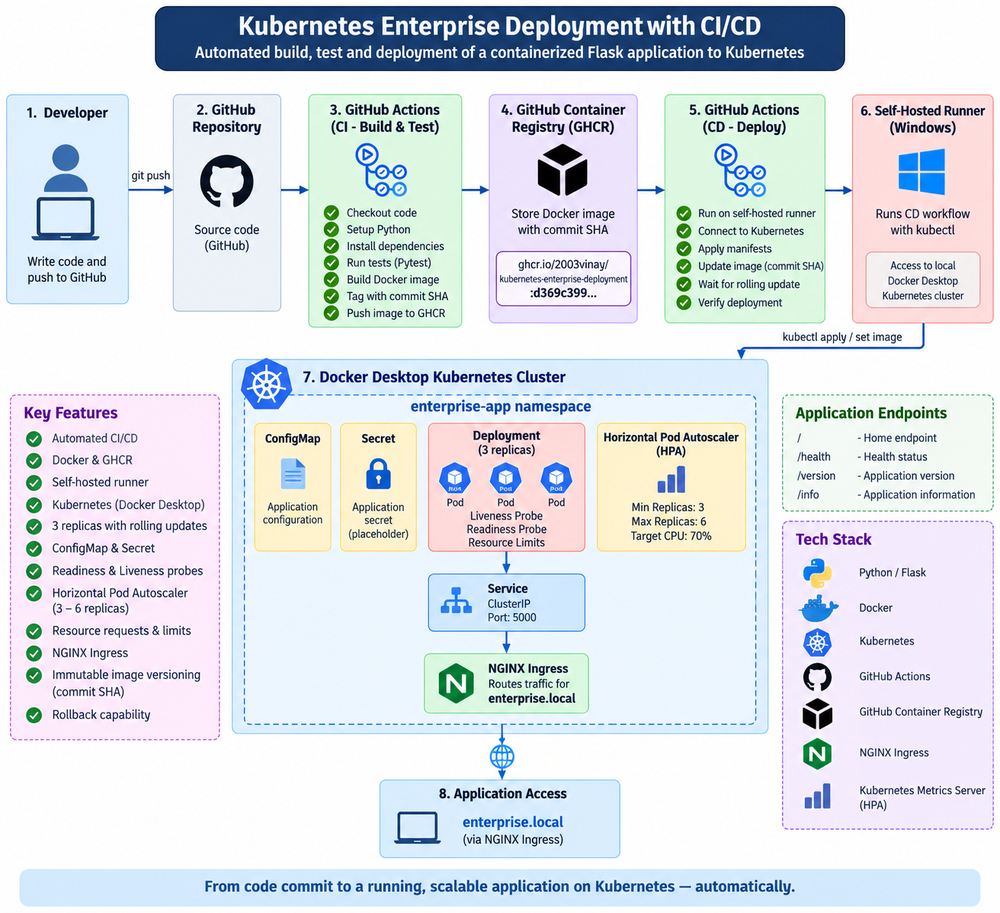

# Kubernetes Enterprise Deployment with CI/CD

An end-to-end DevOps project demonstrating automated CI/CD of a containerized Flask application to Kubernetes using GitHub Actions, Docker, GitHub Container Registry (GHCR), and a self-hosted runner.

## Architecture



## Architecture

The pipeline follows this flow:

Developer → GitHub → GitHub Actions CI → Docker Build → GHCR → Self-Hosted Runner → Kubernetes → NGINX Ingress → Application

## Tech Stack

- Python / Flask
- Docker
- Kubernetes
- GitHub Actions
- GitHub Container Registry (GHCR)
- NGINX Ingress Controller
- Kubernetes Metrics Server
- Horizontal Pod Autoscaler (HPA)

## CI/CD Pipeline

Every push to the `main` branch triggers the pipeline:

1. Checkout source code
2. Configure Python
3. Install dependencies
4. Run automated tests with Pytest
5. Build the Docker image
6. Tag the image using the Git commit SHA
7. Push the image to GHCR
8. Trigger the Windows self-hosted runner
9. Apply Kubernetes manifests
10. Deploy the exact commit SHA image
11. Wait for the Kubernetes rolling update
12. Verify the running pods

## Kubernetes Architecture

The application runs inside the `enterprise-app` namespace.

The Kubernetes environment includes:

- **Deployment** — Runs 3 replicas of the Flask application.
- **Service** — Exposes the application internally on port `5000`.
- **NGINX Ingress** — Routes `enterprise.local` traffic to the application service.
- **ConfigMap** — Stores non-sensitive application configuration.
- **Secret** — Demonstrates Kubernetes secret injection using a placeholder value.
- **Horizontal Pod Autoscaler** — Automatically scales between 3 and 6 replicas based on CPU utilization.
- **Resource Requests and Limits** — Controls CPU and memory allocation for application containers.
- **Readiness Probe** — Checks `/health` before allowing a pod to receive traffic.
- **Liveness Probe** — Checks `/health` and allows Kubernetes to restart unhealthy containers.

## Container Image Versioning

Docker images are published to GitHub Container Registry:

`ghcr.io/2003vinay/kubernetes-enterprise-deployment`

Each deployment uses the Git commit SHA as the image tag.

Example:

```text
ghcr.io/2003vinay/kubernetes-enterprise-deployment:d369c3997749b198b5cd77159dae3793dbb0e35d